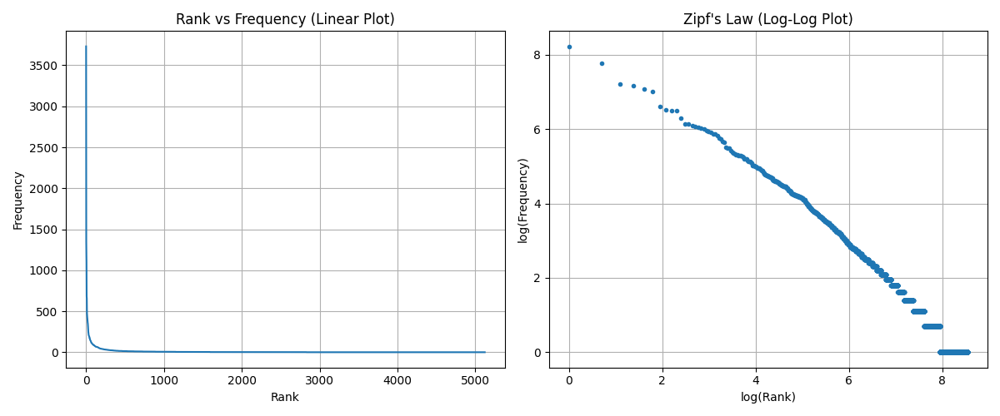
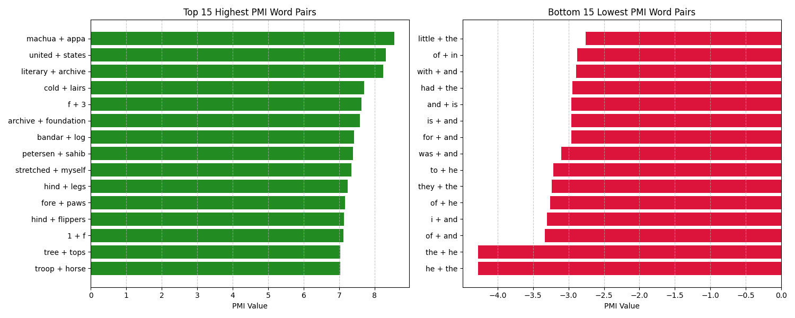
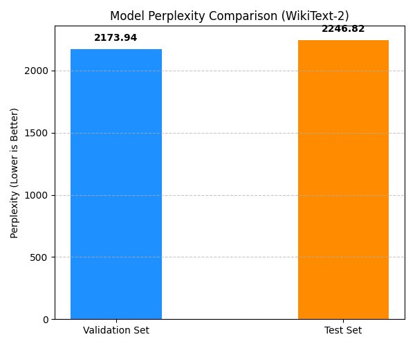

# Statistical NLP: From Corpus Properties to Language Modeling

This repository provides an educational, hands-on walk-through of three fundamental concepts in statistical Natural Language Processing (NLP):
1. **Zipf's Law** — Understanding word distributions in natural language.
2. **Pointwise Mutual Information (PMI)** — Quantifying word associations (collocations).
3. **N-Gram Language Models** — Measuring text predictability using perplexity on the WikiText-2 dataset.

Each module is designed as an interactive lesson, supported by empirical findings and data visualizations.

---

## Repository Structure

The codebase is organized modularly to separate analytical logic from presentation:

```text
nlp-text-analysis/
│
├── data/
│   ├── jungle_book.txt             # Corpus for Zipf's Law & PMI
│   └── wikitext-2-raw/             # Dataset splits for Language Model
│       ├── wiki.train.raw
│       ├── wiki.valid.raw
│       └── wiki.test.raw
│
├── plots/                          # Generated visualization assets
│   ├── zipfs_law_plot.png
│   ├── pmi_distribution.png
│   └── perplexity_comparison.png
│
├── src/
│   ├── __init__.py
│   ├── zipfs_law.py                # Analytical scripts (Module 1)
│   ├── mutual_information.py       # Analytical scripts (Module 2)
│   └── language_model.py           # Analytical scripts (Module 3)
│
├── run.py                          # Unified execution runner
└── requirements.txt
```

---

## Zipf's Law (Word Frequency Distributions)

### The Theory
Zipf's Law is an empirical law stating that in any natural language corpus, the frequency of a word ($f$) is inversely proportional to its rank ($r$) in the frequency table:

$$f(r) \propto \frac{1}{r}$$

This implies that a small number of words (mostly function words/stopwords) are used extremely frequently, while the vast majority of words in a vocabulary occur rarely.

If we take the logarithm of both sides of the proportional equation:

$$\log(f(r)) \approx C - \log(r)$$

This tells us that if we plot the rank versus frequency on a **log-log scale**, the distribution should yield a straight line with a slope near $-1$.

---

### Empirical Findings
Tested on Rudyard Kipling's *The Jungle Book*, we extracted the most frequent words:

*   **Total unique words analyzed**: ~5,100
*   **Top 5 Most Frequent Words**:
    *   `the` : 3,731 occurrences
    *   `and` : 2,355 occurrences
    *   `of` : 1,348 occurrences
    *   `to` : 1,290 occurrences
    *   `a` : 1,173 occurrences

---

### Visualization
Our analysis produces a comparative visualization of linear versus log-log axes:



*   **Linear Plot (Left)**: Shows a classic heavy-tailed distribution, where frequency drops precipitously after the first few ranks.
*   **Log-Log Plot (Right)**: Shows a linear decline, verifying that word occurrences in *The Jungle Book* behave in accordance with Zipf's Law.

---

## Pointwise Mutual Information (PMI)

### The Theory
Simply counting co-occurrences does not tell us whether two words share a strong semantic relationship. For example, the bigram *"of the"* is highly frequent, but its words are combined strictly because of English grammar, not because of a specific semantic link.

**Pointwise Mutual Information (PMI)** measures how much more (or less) often two words occur together than we would expect by random chance, assuming independent distributions:

$$\text{PMI}(w_1, w_2) = \log \frac{P(w_1, w_2)}{P(w_1)P(w_2)}$$

*   **$\text{PMI} > 0$**: The words occur together more frequently than random chance suggests (positive association).
*   **$\text{PMI} \approx 0$**: The words are independent of each other.
*   **$\text{PMI} < 0$**: The words occur together less frequently than random chance suggests (negative association).

*Note: To avoid high PMI scores for rare/unreliable word pairs, we filter out words with an individual frequency of less than 10.*

---

### Empirical Findings
Evaluating bigrams in our corpus reveals two contrasting ends of the PMI spectrum:

#### Highest Association Bigrams (Top 3)
1.  `('machua', 'appa')` — PMI: **8.5495**
2.  `('united', 'states')` — PMI: **8.3083**
3.  `('literary', 'archive')` — PMI: **8.2393**

#### Lowest Association Bigrams (Bottom 3)
1.  `('the', 'he')` — PMI: **-4.2774**
2.  `('he', 'the')` — PMI: **-4.2774**
3.  `('of', 'and')` — PMI: **-3.3301**

---

### Visualization
Plotting the top 15 and bottom 15 PMI word pairs illustrates this boundary clearly:



*   **Left (Green)**: High-PMI pairs are dominated by specific names, fixed idioms, and proper nouns (e.g., *"United States"*, *"Bandar log"*).
*   **Right (Red)**: Low-PMI pairs are combinations of high-frequency pronouns and prepositions (e.g., *"he the"*, *"of and"*). These pairs have large denominator values ($P(w_1)P(w_2)$) relative to their sparse joint probability, reflecting random co-occurrence.

---

## Bigram Language Modeling & Perplexity

### The Theory
A language model estimates the probability distribution over sequences of words. A **Bigram Language Model** assumes the probability of a word depends only on the immediately preceding word (first-order Markov assumption):

$$P(w_1, w_2, \dots, w_n) \approx \prod_{i=1}^{n} P(w_i \mid w_{i-1})$$

Maximum Likelihood Estimation (MLE) computes these probabilities via frequency counts:

$$P(w_i \mid w_{i-1}) = \frac{C(w_{i-1}, w_i)}{C(w_{i-1})}$$

#### Handling Unseen Events (Laplace Smoothing)
If a bigram does not appear in the training corpus, its probability drops to zero, making the overall sequence probability zero. To address this, we apply **Laplace (add-one) smoothing**:

$$P_{\text{Laplace}}(w_i \mid w_{i-1}) = \frac{C(w_{i-1}, w_i) + 1}{C(w_{i-1}) + |V|}$$

where $|V|$ is the size of the vocabulary (including an `<UNK>` token for out-of-vocabulary words).

#### Evaluation (Perplexity)
We measure the performance of our model using **Perplexity (PPL)**. Intuitively, perplexity represents the branching factor of the language model; a lower perplexity indicates the model is less confused and more certain when predicting the next word.

$$\text{PPL} = 2^{-\frac{1}{N} \sum_{i=1}^{N} \log_2 P(w_i \mid w_{i-1})}$$

---

### Empirical Findings
We trained our bigram model on the `WikiText-2` raw training corpus (ignoring words with a training frequency $\le 10$ as `<UNK>`) and evaluated it on validation and test sets:

*   **Validation Perplexity**: `2173.9393`
*   **Test Perplexity**: `2246.8228`

---

### Visualization
The perplexity comparison shows comparable scores across validation and test datasets:



#### Interpretation & Discussion
The validation and test perplexities are relatively high (exceeding 2,100). This indicates that the language model is quite uncertain during word predictions. There are two primary reasons for this performance:
1.  **Context Limitation**: A bigram model only looks at one preceding word. Natural language contains long-distance dependencies that require broader context.
2.  **Add-One Smoothing Limitations**: Laplace smoothing moves a large amount of probability mass from highly frequent bigrams to unseen bigrams, overestimating the probability of rare word transitions. 

To improve these scores, subsequent iterations could explore **Kneser-Ney smoothing**, **Trigram models**, or **recurrent neural networks (RNNs/Transformers)**.

---

## How to Execute the Project

### Installation
1. Clone the repository:
   ```bash
   git clone https://github.com/Harmish5201/nlp-text-analysis
   cd nlp-text-analysis
   ```
2. Install the minimal dependencies:
   ```bash
   pip install -r requirements.txt
   ```

### Execution
Run the unified script to train the model, calculate statistics, and generate all visualization images in the `plots/` folder:
```bash
python run.py
```